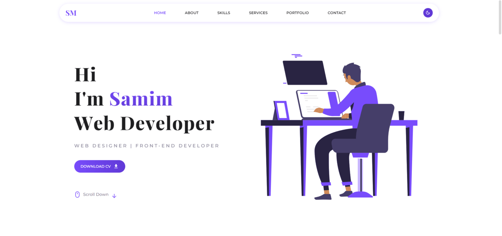

# **PERSONAL PORTFOLIO WEBSITE**

This is a personal portfolio website created with React, Material UI and many other modern technologies. It includes several sections and some cool JavaScript animation. This portfolio was created to showcase personal projects. <a href="https://samimmiddey.netlify.app" target="_blank">Visit</a>

## **ABOUT**

The main motive behind creating this website was to showcase all of my latest work & skills. This website is fully responsive and contains all of my personal information.

## **TOOLS & TECHNOLOGIES USED**

- ReactJS
- ContextAPI
- Material UI
- React Hook Form
- React Icons
- Framer Motion
- EmailJS
- React Leaflet
- React Parallax Tilt
- SwiperJS
- React Lottie